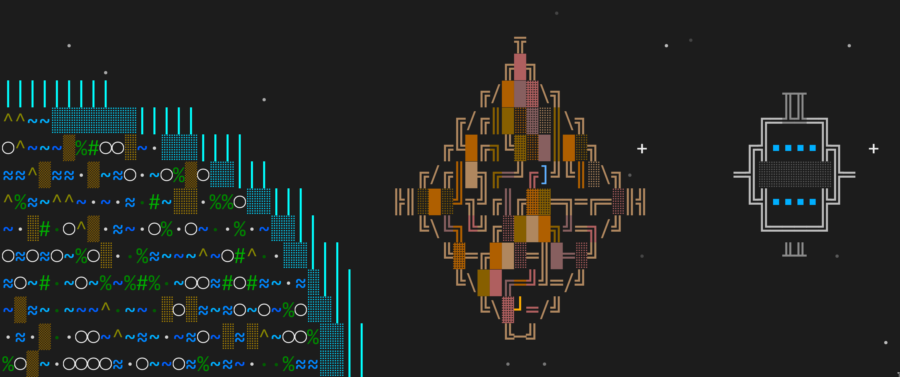

# tw-guidance-computer

Trade Wars 2002 guidance computer — real-time HUD and query tool that parses your game session log and builds a persistent knowledge base.



## Usage

Two entry points:

- `tw-hud <logfile> [--parse-existing]` — runs the live HUD, tails the log, updates SQLite
- `tw <command>` — queries the SQLite DB

### Workflow

1. Start your game session: `script -f ~/src/tw/session2.log` then SSH in
2. In another terminal: `tw-hud ~/src/tw/session2.log --parse-existing`
3. In a third terminal: `tw pairs`, `tw path 865 246`, `tw sell`, etc.

### CLI Commands

```
tw status              # Database summary
tw sector <id>         # Show sector info
tw ports [-t TYPE]     # List known ports
tw pairs               # Find adjacent trade pairs
tw path <start> <end>  # Find shortest path
tw search <pattern>    # Search ports by type (* = wildcard)
tw nearby <sector> -n  # Find ports within N hops
tw sell                # Find where to sell current cargo
tw chat                # Show recent chat messages
```

### HUD Sections

- **Status bar** — current sector, turns remaining, credits
- **Cargo** — what you're carrying with cost basis, so you can evaluate sell offers against your investment
- **Sell nearby** — closest ports that buy what you're holding
- **Trade pairs** — best adjacent complementary port pairs
- **Comms** — sub-space radio and fed comm-link messages

## Architecture

Hexagonal architecture per [codespecs](docs/codespecs/).

```
src/tw_guidance_computer/
├── domain/
│   ├── models.py              # Sector, Port, CargoHold, PlayerStatus, TradePair
│   └── exceptions.py          # GuidanceError hierarchy
├── application/
│   ├── ports/
│   │   ├── game_state_store.py    # Protocol for persistence
│   │   └── log_reader.py         # Protocol for log input
│   ├── parse_log_chunk.py        # Core parser use case
│   ├── find_trade_pairs.py       # Adjacent complementary port finder
│   ├── find_path.py              # BFS pathfinding
│   └── find_sell_locations.py    # Nearest buyer for current cargo
├── adapters/
│   ├── sqlite_store.py        # SQLite implementation (WAL mode, concurrent-safe)
│   ├── log_reader.py          # tail -f style reader + ANSI stripper
│   └── tui.py                 # Curses HUD
├── hud.py                     # Composition root: tw-hud
└── cli.py                     # Composition root: tw
```

## Setup

```bash
# With uv (recommended)
uv sync

# With pip
pip install -e .
```

## Install from GitHub

```bash
# With uv
uv pip install git+https://github.com/en0/tw-guidance-computer.git

# With pip
pip install git+https://github.com/en0/tw-guidance-computer.git
```

## Development

```bash
uv run pytest           # run tests
uv run mypy src/        # type check
uv run ruff check src/  # lint
```

This project uses an AI development team for new features. See [`.kiro/README.md`](.kiro/README.md) for the workflow.

## Profiles

Configuration is managed through named profiles in `~/.config/tw-guidance-computer/config.ini`. Use `--profile` / `-p` to select a profile, or set a default in the config file.

```bash
tw profile create myserver       # create a new profile
tw -p myserver pairs             # use a specific profile
tw-hud -p myserver --create log  # create + launch in one step
```

See the [migration guide](docs/migration-from-db-flag.md) if you were previously using the `--db` flag.

## Shared Intel Server

Corp mates can pool sector knowledge via a shared SFTP server. The Docker container provides an SFTP-only server — no shell access, no port forwarding.

> **Trust model**: All authenticated players share a single SFTP user chrooted to `/data/`. Any authenticated player can read, overwrite, or delete any file in the data directory. Only grant access to players you trust.

### Quick start

1. **Create the authorized_keys file first** (must exist before `docker run` or Docker creates a directory instead):

   ```bash
   cat ~/.ssh/your_key.pub > authorized_keys
   ```

   Add one public key per line for each player. The key in this file must match the key each player's SSH client offers (their default key, or the key specified by `intel_key` in their config).

2. **Create the data directory:**

   ```bash
   mkdir -p data
   ```

3. **Build and run:**

   ```bash
   docker build -t tw-guidance-computer/intel-server docker/intel-server/
   docker run -d --name tw-intel -p 2222:22 \
     -v "$(pwd)/authorized_keys:/etc/tw-intel/keys:ro" \
     -v "$(pwd)/data:/data" \
     tw-guidance-computer/intel-server
   ```

4. **Verify:**

   ```bash
   sftp -P 2222 intel@localhost
   ```

   You should get an `sftp>` prompt. Type `ls` then `bye` to exit.

### Adding player keys

Append public keys to the `authorized_keys` file:

```bash
cat player2.pub >> authorized_keys
```

Changes take effect immediately (sshd re-reads the file on each connection).

### Client configuration

Each player adds intel settings to their profile in `~/.config/tw-guidance-computer/config.ini`:

```ini
[profile:myserver]
intel_host = intel.example.com
intel_key = ~/.ssh/tw_intel_key
intel_port = 2222
```

The `intel_key` must point to the private key whose public half is in the server's `authorized_keys` file.

### Data layout

The server stores one CSV file per player in `/data/intel/`, named by the SHA-256 hash of the player's public key. Files are plain text and human-inspectable.

### Troubleshooting

| Error | Cause | Fix |
|-------|-------|-----|
| `Permission denied (publickey)` | Key mismatch — server doesn't have your public key | Add your `.pub` key to `authorized_keys`: `cat ~/.ssh/your_key.pub > authorized_keys` |
| `Permission denied (publickey)` | Wrong key offered by client | Either set `intel_key` in config to match, or use `sftp -i ~/.ssh/yourkey -P 2222 intel@localhost` |
| `not a regular file` in docker logs | `authorized_keys` didn't exist before `docker run` | Remove container, create the file, re-run |
| `User intel not allowed because account is locked` | Stale image without the account unlock fix | Rebuild: `docker build --no-cache -t tw-guidance-computer/intel-server docker/intel-server/` |
| `REMOTE HOST IDENTIFICATION HAS CHANGED` | Container was rebuilt (new host keys) | `ssh-keygen -R '[localhost]:2222'` |
| SFTP connects but commands hang | Using lowercase `-p` (preserve times) instead of `-P` (port) | Use `sftp -P 2222` (capital P) |

### Maintenance

```bash
# Inspect data directory
docker exec tw-intel ls -la /data/intel/

# Remove a player's data
docker exec tw-intel rm /data/intel/<keyhash>

# Find corrupt files (checksum mismatch)
docker exec tw-intel sh -c 'for f in /data/intel/*; do
  expected=$(tail -1 "$f" | sed "s/#SHA256://")
  actual=$(head -n -1 "$f" | sha256sum | cut -d" " -f1)
  [ "$expected" != "$actual" ] && echo "CORRUPT: $f"
done'

# Find stale files (30+ days)
docker exec tw-intel find /data/intel -type f -mtime +30 -ls
```

## Data

The SQLite database persists at `~/.local/share/tw-guidance-computer/game.db` and accumulates knowledge across sessions.
